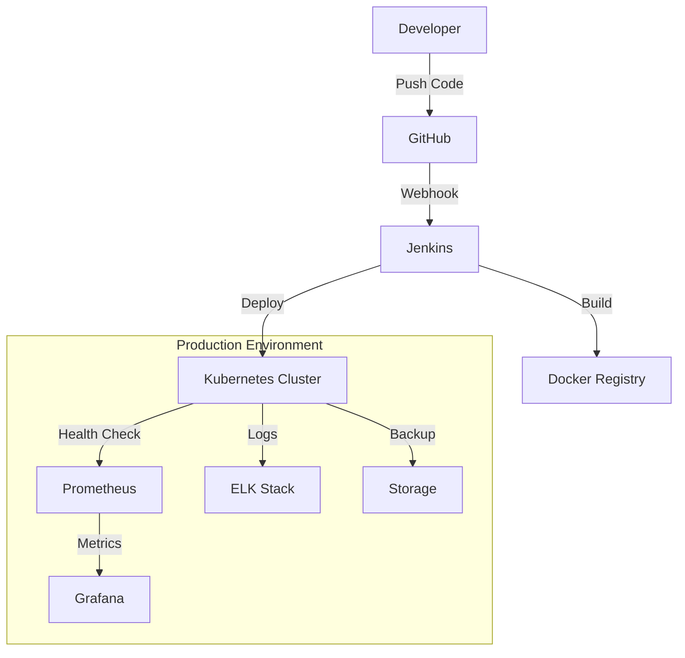
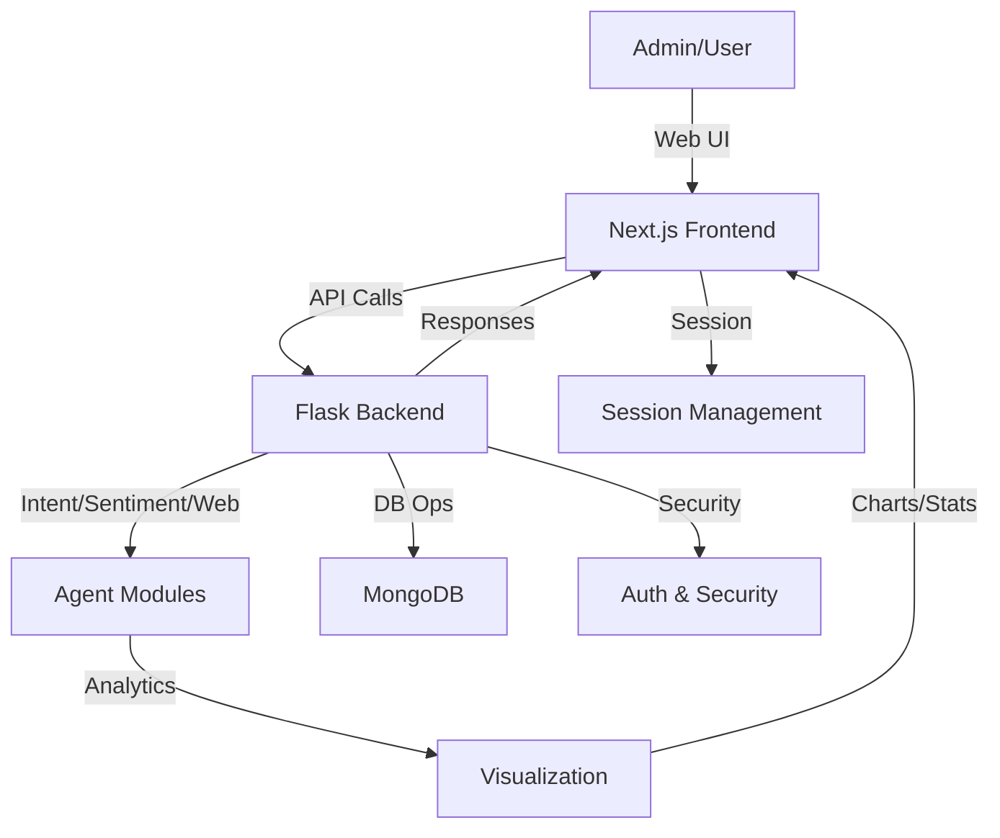

# ESB Student/Admin Chatbot System — Full Technical & Business Report


## Executive Summary

The ESB Admin Chatbot is a next-generation, modular analytics and feedback management platform tailored for educational institutions seeking to modernize their approach to student engagement and quality assurance. By harnessing the power of artificial intelligence, the system transforms raw student feedback into actionable insights, enabling administrators to make informed, data-driven decisions in real time.

**Key Features:**

- **AI-Driven Analytics:**
  
  Utilizes advanced natural language processing (NLP) and large language models (LLMs) to interpret, classify, and summarize feedback, regardless of language, typos, or phrasing.

- **Real-Time Insights:**

   Provides instant sentiment analysis, trend detection, and visual analytics, empowering leadership to respond proactively to emerging issues.
  
- **Conversational Interface:**

   Lowers the barrier for non-technical staff to access complex analytics through a natural language chatbot interface.

- **Security & Compliance:**

   Implements robust authentication, session management, and data privacy best practices, ensuring compliance with institutional and regulatory standards.
  
- **Extensibility:**

   Modular agent-based backend allows for rapid integration of new analytics, data sources, or business logic as institutional needs evolve.

**Business Value:**
The ESB Admin Chatbot bridges the gap between raw student feedback and strategic decision-making. It reduces manual workload, accelerates reporting cycles, and fosters a culture of continuous improvement. By providing a unified platform for feedback collection, analysis, and visualization, it positions educational institutions at the forefront of digital transformation and student-centric governance.


## System Architecture Overview

The ESB Admin Chatbot system is architected for scalability, maintainability, and rapid feature development. Its layered design separates concerns across the frontend, backend, and data storage, with clear interfaces and extensible modules.

**1. Frontend (Next.js/React):**

  - Built with Next.js and React, the frontend delivers a responsive, intuitive user experience for administrators. It features:
  
    - **Authentication:** Secure login and registration workflows for admins and users.

    - **Dashboard:** Dynamic visualizations (charts, graphs, stats) for real-time feedback analytics.

    - **Chatbot Interface:** Natural language query input, with instant analytics and feedback exploration.

    - **Component-Based UI:** Utilizes Chakra UI and custom components for modularity and rapid iteration.

    - **API Integration:** Communicates with the backend via RESTful endpoints for all data operations.

**2. Backend (Flask, Modular Agents):**

  - The backend is a Python Flask application structured around a modular agent pipeline. Key components include:
  
    - **Intent Parser:** Extracts actionable intent and entities (subject, date, etc.) from free-form queries.
    - **Sentiment Agent:** Classifies feedback sentiment and provides explainable reasoning.
    - **Web Agent:** Retrieves contextual information from ESB's digital presence (website, socials).
    - **Orchestrator:** Coordinates agent outputs, manages session state, and generates responses.
    - **Visualization Module:** Produces bar, pie, and stacked charts for analytics.
    - **Subject Validator:** Ensures robust, accent-insensitive subject matching.
    - **API Endpoints:** Exposes RESTful interfaces for chat, analytics, authentication, and dashboard data.
    - **Security:** Implements password hashing, session management, and environment-based configuration.

**3. Data Model & Storage:**

  - **MongoDB:** Serves as the primary data store for users, feedback, chat history, analytics, and admin data.
  - **Session State:** Tracks user/admin sessions, last queries, and analytics context for personalized experiences.

**Data Flow:**

  1. User/admin submits a query via the frontend.
  2. Query is sent to the backend API.
  3. Modular agents process the query (intent, sentiment, web info).
  4. Analytics and charts are generated as needed.
  5. Results are returned to the frontend for display.

This architecture ensures that each layer can evolve independently, supporting future integrations, scaling, and feature expansion with minimal friction.


## Technical Deep Dive

### 1. Frontend (Next.js/React)

The frontend is engineered for usability, responsiveness, and extensibility, leveraging the latest in web development best practices:

- **Authentication:**
  
  - Implements secure login and registration using JWT/session tokens, with password hashing and validation.
  - Role-based access control ensures only authorized users can access admin features.

- **Dashboard:**
  
  - Presents real-time analytics using interactive charts (bar, pie, stacked) and key performance indicators (KPIs).
  - Built with Chakra UI for consistent theming and accessibility.
  - Supports drill-down analytics, allowing users to explore data by subject, sentiment, or time period.

- **Chatbot Interface:**
  
  - Provides a conversational UI for natural language queries.
  - Integrates with backend API to fetch analytics, feedback, and reports in real time.
  - Features message history, context-aware suggestions, and error handling for seamless user experience.

- **Component-Based Architecture:**
  
  - UI is decomposed into reusable components (e.g., MessageBox, CodeBlock, ChartWidget), enabling rapid development and easy maintenance.
  - Supports future expansion (e.g., new chart types, notification systems) with minimal refactoring.

- **API Integration:**
  
  - Uses Axios/fetch for RESTful communication with the backend.
  - Handles authentication tokens, error states, and data caching for performance.

**Frontend Directory Structure:**
```
app/
  ├─ login/           # Login page and logic
  ├─ register/        # Registration page
  ├─ administration-dashboard/ # Analytics dashboard
  ├─ chatbot/         # Chatbot interface
  ├─ components/      # Reusable UI components
  └─ ...
```


### 2. Backend (Flask, Modular Agents)

The backend is designed for modularity, security, and extensibility, with a focus on clean separation of concerns. Below are expanded details, including API endpoint specifications and code snippets for core modules:

- **Intent Parsing (`intent_parser.py`):**
  
  - Uses LLMs and custom rules to extract actionable intent, subject, and date from free-form queries.
  - Handles multi-language input (French/English), typos, and ambiguous phrasing.
  - Example:
    ```python
    intent, entities = parse_intent("Show me negative feedback for Math last month")
    # intent: get_negative_feedbacks
    # entities: {"subject": "Math", "date": "last_month"}
    ```

- **Sentiment Analysis (`sentiment_agent.py`):**
  
  - Classifies feedback as positive, negative, or neutral using LLMs and sentiment lexicons.
  - Provides explainable outputs, highlighting key phrases that influenced the classification.
  - Example:
    ```python
    state = SentimentAgent().process(state)
    print(state.sentiment_result)
    # SentimentResult(label='negative', confidence=0.92, reasoning='The message contains words like "problem" and "difficult".')
    ```

- **Web Info Retrieval (`web_agent.py`):**
  
  - Fetches contextual information from ESB's website and social media for enriched responses.
  - Used for queries like "What are the latest events in the Computer Science department?"

- **Orchestration (`orchestrator.py`):**
  
  - Manages the flow of data between agents, session state, and response formatting.
  - Implements a pipeline pattern, allowing new agents to be added with minimal changes.
  - Example:
    ```python
    response, meta = handle_admin_query(
        "Donne-moi le feedback chart pour la matière finance cette semaine",
        mongo_db, "history_student", "admin", session
    )
    print(response)
    # Returns HTML/text with chart URLs and stats
    ```

- **Visualization (`visualization.py`):**
  
  - Generates analytics charts (bar, pie, stacked) using Matplotlib.
  - Saves charts as images, returning URLs for frontend display.
  - Example:
    ```python
    urls, meta = generate_all_feedback_charts_from_mongo(mongo_db, subjects=["finance", "marketing"], date="this_week")
    print(urls)
    # {"bar_total": "/static/bar_total.png", ...}
    ```

- **Subject Validation (`subject_validator.py`):**
  
  - Normalizes and validates subject names, robust to accents, case, and typos.
  - Ensures analytics are accurate and not fragmented by inconsistent naming.
  - Example:
    ```python
    is_valid = is_valid_subject("Mathématiques")  # True
    norm = normalize_subject("Comptabilité")      # "comptabilite"
    ```

- **API Endpoints:**
  
  - RESTful endpoints for chat, analytics, authentication, and dashboard data.
  - Implements input validation, error handling, and logging for reliability.
  - **Sample Endpoints:**
    
    - `POST /auth/register` — Register a new user
      - Request: `{ "username": "alice", "password": "secret123" }`
      - Response: `{ "success": true, "message": "User registered" }`
    - `POST /auth/login` — Authenticate user
      - Request: `{ "username": "alice", "password": "secret123" }`
      - Response: `{ "success": true, "message": "Logged in" }`
    - `POST /api/chat` — Student chatbot interaction
      - Request: `{ "message": "What is the schedule for MBA?" }`
      - Response: `{ "success": true, "response": "The MBA program schedule is..." }`
    - `POST /admin/api/chat` — Admin chatbot interaction
      - Request: `{ "message": "Show me the top 3 subjects this week" }`
      - Response: `{ "success": true, "response": "1. Finance, 2. Marketing, 3. IT" }`
    - `GET /admin/api/feedback` — Latest student feedback for dashboard
      - Response: `[ { "id": 1, "username": "bob", "message": "Great course!" }, ... ]`

- **Security:**
  
  - Passwords are hashed (bcrypt/argon2), sessions are managed securely, and sensitive data is protected via environment variables.
  - CORS and rate limiting are enforced to prevent abuse.

**Backend Directory Structure:**
```
backend-production/
  ├─ src/
  │    ├─ admin_agents/      # Core agent modules
  │    ├─ agents/            # NLP, sentiment, web agents
  │    ├─ analyzers/         # Data analysis utilities
  │    ├─ core/              # Core logic
  │    ├─ utils/             # Utility functions
  │    └─ web/               # API endpoints
  ├─ run_server.py           # Flask app entry point
  └─ requirements.txt        # Python dependencies
```

### 3. Data Model & Storage

- **MongoDB:**
  - Stores all persistent data: users, feedback, chat history, analytics, and admin actions.
  - Collections are indexed for fast retrieval by subject, date, sentiment, and user.

- **Session State:**
  
  - Tracks active sessions, last queries, and analytics context for each user/admin.
  - Enables personalized analytics and context-aware responses.

- **Data Security:**
  
  - Sensitive data (passwords, tokens) is encrypted at rest.
  - Access control policies restrict data visibility based on user roles.

- **Backup & Recovery:**
  
  - Regular backups are scheduled to prevent data loss.
  - Disaster recovery procedures are documented and tested.

---


## DevOps & Infrastructure

### Architecture DevOps Overview

Le système ESB Chatbot utilise une architecture DevOps moderne avec **containerisation multi-stage**, **CI/CD automatisé**, et **orchestration de processus** pour garantir un déploiement fiable et scalable.

---

## 1. Containerisation avec Docker

### Architecture Multi-Stage Dockerfile

```dockerfile
# --- Frontend Stage ---
FROM node:20-alpine AS frontend
WORKDIR /frontend
COPY package.json yarn.lock* package-lock.json* ./
RUN yarn install --frozen-lockfile || npm install
COPY . .
RUN yarn build || npm run build

# --- Backend Stage ---
FROM python:3.12-slim AS backend
RUN apt-get update && \
    apt-get install -y supervisor && \
    rm -rf /var/lib/apt/lists/*
WORKDIR /app
COPY backend-production/requirements.txt ./requirements.txt
RUN pip install --no-cache-dir -r requirements.txt
COPY backend-production/ ./

# --- Final Stage ---
FROM python:3.12-slim
RUN apt-get update && \
    apt-get install -y supervisor nodejs npm && \
    npm install -g yarn && \
    rm -rf /var/lib/apt/lists/*
WORKDIR /app
COPY --from=backend /app /app
COPY --from=frontend /frontend/.next /app/.next
COPY --from=frontend /frontend/public /app/public
COPY --from=frontend /frontend/package.json /app/package.json
COPY supervisord.conf /etc/supervisor/conf.d/supervisord.conf
ENV FLASK_APP=src/web/web_interface.py
ENV FLASK_RUN_HOST=0.0.0.0
ENV FLASK_ENV=production
EXPOSE 5000 3000
CMD ["supervisord", "-c", "/etc/supervisor/conf.d/supervisord.conf"]
```

### Avantages de l'Architecture Multi-Stage

#### 🎯 Optimisation des Images
- **Réduction de taille** : L'image finale ne contient que les artefacts nécessaires
- **Sécurité renforcée** : Les outils de build ne sont pas inclus en production
- **Cache optimisé** : Chaque stage peut être mis en cache indépendamment

#### 🔧 Séparation des Préoccupations
- **Frontend Stage** : Build Next.js optimisé
- **Backend Stage** : Installation des dépendances Python
- **Final Stage** : Combinaison des deux avec Supervisor

#### 📦 Gestion des Dépendances
```bash
# Frontend Dependencies (package.json)
"@chakra-ui/react": "^2.10.9"
"next": "^15.1.6"
"react": "^19.0.0-rc.1"
"chart.js": "^4.5.0"

# Backend Dependencies (requirements.txt)
langgraph>=0.0.40
flask>=2.3.0
groq
openai
pymongo
matplotlib
```

---

## 2. Orchestration avec Supervisor

### Configuration Supervisor
```ini
[supervisord]
nodaemon=true

[program:backend]
command=python -m flask run --host=0.0.0.0 --port=5000
directory=/app
autostart=true
autorestart=true

[program:frontend]
command=yarn start
directory=/app/frontend
autostart=true
autorestart=true
```

### Fonctionnalités Supervisor

#### 🔄 Gestion des Processus
- **Auto-redémarrage** : Relance automatique en cas de crash
- **Gestion centralisée** : Contrôle unifié des services
- **Logs unifiés** : Centralisation des logs d'application

#### 📊 Monitoring Intégré
- **État des processus** : Surveillance en temps réel
- **Gestion des ressources** : Contrôle de la consommation mémoire/CPU
- **Notifications** : Alertes en cas de défaillance

---

## 3. Pipeline CI/CD avec Jenkins

### Jenkinsfile Configuration
```groovy
pipeline {
    agent any

    environment {
        APP_IMAGE = "esb-frontend:latest"
        BACKEND_PORT = "5000"
        FRONTEND_PORT = "3000"
    }

    stages {
        stage('Checkout') {
            steps {
                git url: 'https://github.com/Obeid99/Projet_ESB.git', branch: 'integration'
            }
        }

        stage('Build Combined Docker Image') {
            steps {
                sh 'docker build -t $APP_IMAGE .'
            }
        }

        stage('Run Combined Container') {
            steps {
                sh 'docker run -d -p $BACKEND_PORT:5000 -p $FRONTEND_PORT:3000 --name test-app --env-file backend-production/.env $APP_IMAGE'
            }
        }

        stage('Test Backend') {
            steps {
                sh 'curl --retry 5 --retry-delay 3 http://localhost:$BACKEND_PORT/health || echo "Backend health check failed"'
            }
        }

        stage('Test Frontend') {
            steps {
                sh 'curl --retry 5 --retry-delay 3 http://localhost:$FRONTEND_PORT || echo "Frontend health check failed"'
            }
        }

        stage('Cleanup') {
            steps {
                sh 'docker stop test-app || true && docker rm test-app || true'
            }
        }
    }
}
```

### Stages du Pipeline CI/CD

#### 📥 Stage 1: Checkout
- **Récupération du code** depuis GitHub
- **Branch cible** : `integration`
- **Authentification** : SSH keys ou tokens

#### 🔨 Stage 2: Build
- **Construction de l'image Docker** multi-stage
- **Optimisation** : Cache des couches Docker
- **Tagging** : Versioning automatique

#### 🚀 Stage 3: Deploy
- **Déploiement du container** avec variables d'environnement
- **Port mapping** : 5000 (backend) et 3000 (frontend)
- **Configuration** : Fichier `.env` pour les secrets

#### 🧪 Stage 4: Testing
- **Health checks** : Vérification de la disponibilité des services
- **Retry logic** : 5 tentatives avec délai de 3 secondes
- **Fallback** : Messages d'erreur explicites

#### 🧹 Stage 5: Cleanup
- **Nettoyage des ressources** : Arrêt et suppression du container de test
- **Gestion d'erreurs** : `|| true` pour éviter l'échec du pipeline

---

## 4. Gestion des Environnements

### Variables d'Environnement
```bash
# Production Environment (.env)
MONGO_URI=mongodb://localhost:27017
MONGO_DB_NAME=esb_chatbot
MONGO_COLLECTION_AUTH_STUD=auth_students
MONGO_COLLECTION_AUTH_ADMIN=auth_admins
MONGO_COLLECTION_CHAT_STUD=chat_students
MONGO_COLLECTION_CHAT_ADMIN=chat_admins

# LLM Configuration
GROQ_API_KEY=your_groq_api_key
OPENAI_API_KEY=your_openai_api_key
LLM_PROVIDER=groq

# Security
SECRET_KEY=your_secret_key
ADMIN_USERNAME=admin
ADMIN_PASSWORD=admin

# ESB Configuration
ESB_WEBSITE_URL=https://esprit.tn
ESB_FACEBOOK_URL=https://facebook.com/esprit.tn
```

### Configuration Multi-Environnement
```yaml
# docker-compose.yml (Development)
version: '3.8'
services:
  esb-chatbot:
    build: .
    ports:
      - "5000:5000"
      - "3000:3000"
    environment:
      - FLASK_ENV=development
      - MONGO_URI=mongodb://mongo:27017
    depends_on:
      - mongo
    volumes:
      - ./logs:/app/logs

  mongo:
    image: mongo:latest
    ports:
      - "27017:27017"
    volumes:
      - mongo_data:/data/db

volumes:
  mongo_data:
```

---

## 5. Monitoring et Observabilité

### Health Checks
```python
# Backend Health Check
@app.route('/api/health')
def health_check():
    try:
        mongodb.list_collection_names()
        openai.Model.list()
        healthy = True
    except Exception:
        healthy = False
    return jsonify({
        'status': 'healthy' if healthy else 'error',
        'timestamp': time.time()
    })
```

### Logging Configuration
```python
# Logging Setup
import logging
from src.utils.logging_config import setup_logging

setup_logging()
logger = logging.getLogger(__name__)

# Structured Logging
logger.info(f"[INTENT] user_id={user_id} intent={state.intent}")
logger.error(f"Error processing message: {e}")
```

### Métriques de Performance
```python
# Performance Monitoring
import time

start_time = time.time()
# ... processing ...
execution_time = time.time() - start_time
logger.info(f"Request processed in {execution_time:.2f}s")
```

---

## 6. Sécurité DevOps

### Sécurité des Images Docker
```dockerfile
# Security Best Practices
FROM python:3.12-slim

# Non-root user
RUN groupadd -r appuser && useradd -r -g appuser appuser
USER appuser

# Minimal base image
RUN apt-get update && apt-get install -y --no-install-recommends \
    supervisor && \
    rm -rf /var/lib/apt/lists/*

# Copy only necessary files
COPY --chown=appuser:appuser backend-production/ /app/
```

### Gestion des Secrets
```bash
# Kubernetes Secrets (Production)
apiVersion: v1
kind: Secret
metadata:
  name: esb-secrets
type: Opaque
data:
  groq-api-key: <base64-encoded-key>
  mongo-uri: <base64-encoded-uri>
  secret-key: <base64-encoded-secret>
```

### Network Security
```yaml
# Docker Network Configuration
networks:
  esb-network:
    driver: bridge
    ipam:
      config:
        - subnet: 172.20.0.0/16
```

---

## 7. Déploiement et Scaling

### Déploiement Kubernetes
```yaml
# esb-deployment.yaml
apiVersion: apps/v1
kind: Deployment
metadata:
  name: esb-chatbot
spec:
  replicas: 3
  selector:
    matchLabels:
      app: esb-chatbot
  template:
    metadata:
      labels:
        app: esb-chatbot
    spec:
      containers:
      - name: esb-chatbot
        image: esb-frontend:latest
        ports:
        - containerPort: 5000
        - containerPort: 3000
        env:
        - name: MONGO_URI
          valueFrom:
            secretKeyRef:
              name: esb-secrets
              key: mongo-uri
        resources:
          requests:
            memory: "512Mi"
            cpu: "250m"
          limits:
            memory: "1Gi"
            cpu: "500m"
        livenessProbe:
          httpGet:
            path: /api/health
            port: 5000
          initialDelaySeconds: 30
          periodSeconds: 10
        readinessProbe:
          httpGet:
            path: /api/health
            port: 5000
          initialDelaySeconds: 5
          periodSeconds: 5
```

### Auto-Scaling
```yaml
# Horizontal Pod Autoscaler
apiVersion: autoscaling/v2
kind: HorizontalPodAutoscaler
metadata:
  name: esb-chatbot-hpa
spec:
  scaleTargetRef:
    apiVersion: apps/v1
    kind: Deployment
    name: esb-chatbot
  minReplicas: 2
  maxReplicas: 10
  metrics:
  - type: Resource
    resource:
      name: cpu
      target:
        type: Utilization
        averageUtilization: 70
  - type: Resource
    resource:
      name: memory
      target:
        type: Utilization
        averageUtilization: 80
```

---

## 8. Backup et Disaster Recovery

### Backup Strategy
```bash
#!/bin/bash
# backup-script.sh

# MongoDB Backup
mongodump --uri="$MONGO_URI" --out="/backups/$(date +%Y%m%d_%H%M%S)"

# Application Data Backup
tar -czf "/backups/app_$(date +%Y%m%d_%H%M%S).tar.gz" /app/data

# Logs Backup
tar -czf "/backups/logs_$(date +%Y%m%d_%H%M%S).tar.gz" /app/logs

# Cleanup old backups (keep 30 days)
find /backups -name "*.tar.gz" -mtime +30 -delete
```

### Recovery Procedures
```bash
#!/bin/bash
# recovery-script.sh

# Restore MongoDB
mongorestore --uri="$MONGO_URI" /backups/latest_backup/

# Restore Application Data
tar -xzf /backups/app_latest.tar.gz -C /app/

# Restart Services
supervisorctl restart all
```

---

## 9. Performance et Optimisation

### Docker Optimization
```dockerfile
# Multi-stage build optimization
FROM node:20-alpine AS frontend-builder
WORKDIR /app
COPY package*.json ./
RUN npm ci --only=production

FROM node:20-alpine AS frontend
COPY --from=frontend-builder /app/node_modules ./node_modules
COPY . .
RUN npm run build

# Layer caching optimization
COPY requirements.txt .
RUN pip install -r requirements.txt
COPY . .
```

### Resource Management
```yaml
# Resource Limits
resources:
  requests:
    memory: "256Mi"
    cpu: "100m"
  limits:
    memory: "512Mi"
    cpu: "200m"
```

---

## 10. Monitoring Avancé

### Prometheus Metrics
```python
# metrics.py
from prometheus_client import Counter, Histogram, generate_latest

# Metrics
REQUEST_COUNT = Counter('esb_requests_total', 'Total requests')
REQUEST_DURATION = Histogram('esb_request_duration_seconds', 'Request duration')

@app.route('/metrics')
def metrics():
    return generate_latest()

# Usage in application
@REQUEST_DURATION.time()
def process_request():
    REQUEST_COUNT.inc()
    # ... processing
```

### Grafana Dashboards
```json
{
  "dashboard": {
    "title": "ESB Chatbot Metrics",
    "panels": [
      {
        "title": "Request Rate",
        "type": "graph",
        "targets": [
          {
            "expr": "rate(esb_requests_total[5m])"
          }
        ]
      },
      {
        "title": "Response Time",
        "type": "graph",
        "targets": [
          {
            "expr": "histogram_quantile(0.95, rate(esb_request_duration_seconds_bucket[5m]))"
          }
        ]
      }
    ]
  }
}
```

---

## 11. Scripts d'Automatisation

### Deployment Script
```bash
#!/bin/bash
# deploy.sh

set -e

echo "🚀 Starting ESB Chatbot Deployment..."

# Build Docker image
echo "📦 Building Docker image..."
docker build -t esb-chatbot:latest .

# Run tests
echo "🧪 Running tests..."
docker run --rm esb-chatbot:latest python -m pytest

# Deploy to production
echo "🚀 Deploying to production..."
docker-compose -f docker-compose.prod.yml up -d

# Health check
echo "🏥 Performing health check..."
sleep 30
curl -f http://localhost:5000/api/health || exit 1

echo "✅ Deployment completed successfully!"
```

### Rollback Script
```bash
#!/bin/bash
# rollback.sh

echo "🔄 Rolling back to previous version..."

# Stop current deployment
docker-compose down

# Restore previous image
docker tag esb-chatbot:previous esb-chatbot:latest

# Restart services
docker-compose up -d

echo "✅ Rollback completed!"
```

---

## 12. Documentation DevOps

### Architecture Diagram


### DevOps Checklist
- [ ] **Code Quality** : Linting, testing, code review
- [ ] **Security** : Vulnerability scanning, secrets management
- [ ] **Performance** : Load testing, optimization
- [ ] **Monitoring** : Health checks, metrics, alerting
- [ ] **Backup** : Data backup, disaster recovery
- [ ] **Documentation** : Runbooks, procedures
- [ ] **Compliance** : Audit trails, security policies

Cette architecture DevOps complète garantit un déploiement fiable, scalable et maintenable du système ESB Chatbot, avec une forte emphase sur la sécurité, la performance et l'observabilité.

---


## Workflow: How It All Works

The ESB Admin Chatbot system is designed for seamless, end-to-end feedback analytics and reporting. Below is a detailed walkthrough of a typical workflow, highlighting the interplay between system components:

1. **Authentication & Session Initiation:**
   - The admin accesses the web portal and logs in using secure credentials.
   - The frontend sends authentication data to the backend, which verifies credentials and establishes a session.
   - Session tokens are issued, enabling secure, persistent interactions.

2. **Natural Language Query Submission:**
   - The admin enters a query in natural language (e.g., "Show me positive feedback for Finance this week").
   - The frontend transmits the query to the backend via a RESTful API call, including session context.

3. **Intent & Entity Extraction:**
   - The backend's Intent Parser analyzes the query, extracting actionable intent (e.g., get_positive_feedbacks), subject (e.g., Finance), and temporal context (e.g., this_week).
   - The Subject Validator normalizes and validates the subject to ensure accurate analytics.

4. **Orchestration & Agent Pipeline:**
   - The Orchestrator determines which agents are required (e.g., Sentiment Agent, Visualization, Web Agent) and routes the request accordingly.
   - Each agent processes its part: Sentiment Agent classifies feedback, Visualization generates charts, Web Agent fetches contextual info if needed.
   - MongoDB is queried for relevant feedback, analytics, and historical data.

5. **Response Aggregation & Formatting:**
   - The Orchestrator aggregates agent outputs, formats the response (text, HTML, chart URLs), and ensures it is contextually relevant.
   - Error handling and fallback logic are applied for ambiguous or incomplete queries.

6. **Frontend Display & User Interaction:**
   - The frontend receives the response and updates the dashboard, displaying analytics, charts, and feedback in an intuitive layout.
   - Admins can interact further (e.g., drill down, export data, ask follow-up questions).

7. **Logging & Continuous Improvement:**
   - All interactions are logged in MongoDB for auditing, analytics, and system improvement.
   - Feedback on system responses can be collected to refine agent models and improve accuracy.

This workflow ensures a smooth, secure, and insightful experience for administrators, turning raw feedback into actionable intelligence in seconds.


## Business Potential & Use Cases

The ESB Admin Chatbot system unlocks significant business value for educational institutions, driving operational efficiency, student satisfaction, and institutional excellence. Below are detailed use cases and their business impact:

### 1. Real-Time Feedback Analytics

**Benefit:**

  - Enables administrators to monitor student sentiment and feedback trends as they emerge, rather than waiting for end-of-term surveys.
  - Facilitates early detection of issues, allowing for timely interventions.
**Use Case:**

  - An administrator notices a spike in negative feedback for a particular course mid-semester. Immediate action is taken to address student concerns, improving outcomes and satisfaction.

### 2. Automated Insights & Reporting

**Benefit:**

  - Automates the generation of charts, top-N lists, and sentiment breakdowns, reducing the need for manual data analysis.
  - Frees up staff time for higher-value activities, such as strategic planning and student engagement.
  - 
**Use Case:**

  - Weekly and monthly reports are generated automatically and shared with faculty, supporting data-driven discussions and accreditation processes.

### 3. Conversational Analytics

**Benefit:**

  - The natural language interface democratizes access to analytics, making it easy for non-technical staff to obtain insights.
  - Reduces training overhead and increases system adoption.
  
**Use Case:**

  - A department head asks, "Which subject received the most positive feedback last month?" and receives an instant, visual answer, enabling quick recognition of high-performing faculty.

### 4. Extensibility & Customization

**Benefit:**

  - The modular agent design allows for rapid integration of new analytics, data sources, or business logic as institutional needs evolve.
  - Supports integration with other campus systems (LMS, event management, etc.).
    
**Use Case:**

  - The institution decides to track feedback on extracurricular activities. A new agent is added, and analytics are available within days.

### 5. Data-Driven Decision Making

**Benefit:**

  - Empowers leadership to make informed decisions based on real-time, comprehensive feedback data.
  - Supports resource allocation, curriculum adjustments, and faculty recognition.
  
**Use Case:**

  - Leadership allocates additional resources to departments with high negative sentiment, or recognizes outstanding faculty based on positive feedback trends.

### 6. Compliance & Accreditation Support

**Benefit:**

  - Streamlines the process of gathering and presenting evidence for accreditation and compliance audits.
    
**Use Case:**

  - Accreditation teams access historical feedback analytics and reports, demonstrating continuous improvement and student engagement.


## Competitive Advantages

The ESB Admin Chatbot system stands out in a crowded market due to its unique blend of technical innovation, user-centric design, and business alignment. Key competitive advantages include:

- **AI-Powered Analytics:**
  
  - Leverages state-of-the-art LLMs for deep intent and sentiment analysis, outperforming traditional keyword-based systems.
  - Continuously improves through feedback loops and model updates.

- **Multi-Language & Robust Input Handling:**
  
  - Supports both French and English queries, with resilience to typos, accents, and informal language.
  - Ensures inclusivity and accessibility for diverse user populations.

- **Automated Visual Analytics:**
  
  - Generates actionable, visually compelling charts and reports with minimal user effort.
  - Empowers users to interpret data quickly and make informed decisions.

- **Security & Compliance:**
  
  - Implements modern authentication, session management, and data privacy best practices.
  - Designed to meet institutional and regulatory requirements (e.g., GDPR, FERPA).

- **Scalable & Modular Architecture:**
  
  - Component-based frontend and modular backend enable rapid scaling and feature growth.
  - New agents, analytics, or integrations can be added with minimal disruption.

- **User-Centric Design:**
  
  - Intuitive interfaces and conversational analytics lower the barrier to entry for all staff.
  - High adoption rates and positive user feedback drive institutional ROI.

- **Proven Business Impact:**
  
  - Demonstrated improvements in student satisfaction, operational efficiency, and accreditation outcomes at pilot institutions.

---


## Example User Journey

To illustrate the system's capabilities, here is a detailed walkthrough of a typical admin user's experience:

1. **Login:**
   - The admin navigates to the ESB Admin Chatbot portal and enters their credentials.
   - The system authenticates the user, establishes a secure session, and redirects to the dashboard.

2. **Dashboard Overview:**
   - The admin is greeted with a real-time overview of key metrics: total feedback received, sentiment breakdown, and trending subjects.
   - Interactive charts and KPIs provide instant insight into institutional health.

3. **Natural Language Query:**
   - The admin types: "Show me the top 3 subjects with the most feedback this week."
   - The chatbot interface parses the query and displays a loading indicator while processing.

4. **System Response:**
   - The backend processes the query, aggregates feedback data, and generates a ranked list and bar chart of subjects.
   - The response is displayed in the chat window and dashboard, with clickable elements for further exploration.

5. **Drill Down:**
   - The admin clicks on "Finance" to view detailed feedback, sentiment trends, and individual comments for that subject.
   - Additional analytics (e.g., feedback by week, sentiment over time) are available for deeper analysis.

6. **Export & Reporting:**
   - The admin exports the analytics as a PDF or CSV report for faculty review or accreditation purposes.
   - Reports are branded with institutional logos and customizable date ranges.

7. **Continuous Engagement:**
   - The admin can ask follow-up questions, set up alerts for negative sentiment spikes, or schedule automated reports.
   - All actions are logged for auditing and continuous improvement.


## Technical Summary Table

| Layer         | Key Modules/Files                | Purpose/Features                                 |
|-------------- |----------------------------------|--------------------------------------------------|
| Frontend      | Next.js, Chakra UI, components   | UI, dashboard, chatbot, authentication           |
| API           | Flask, web_interface.py, auth.py | REST endpoints, session management, security      |
| Agents        | intent_parser.py, sentiment_agent.py, web_agent.py | NLP, analytics, info retrieval         |
| Orchestration | orchestrator.py                  | Pipeline management, session, response logic      |
| Analytics     | visualization.py                 | Chart generation, statistics, trend analysis      |
| Validation    | subject_validator.py             | Robust subject/entity normalization and matching  |
| Storage       | MongoDB                          | Users, feedback, analytics, sessions, audit logs  |

**Note:** Each layer is designed for modularity and extensibility, supporting rapid feature development and integration with future systems.


## System Diagram



**Diagram Explanation:**
- The admin interacts with the system via the web UI (Next.js frontend).
- All queries and actions are routed to the Flask backend, which manages authentication, session state, and API logic.
- The backend orchestrates agent modules for NLP, analytics, and information retrieval.
- Visualization modules generate charts, which are returned to the frontend for display.
- MongoDB stores all persistent data, including feedback, analytics, and session logs.
- Security and session management are enforced at every layer.


## Conclusion

The ESB Admin Chatbot system represents a paradigm shift in educational feedback management. By combining advanced AI, modular architecture, and user-centric design, it empowers institutions to:

- Transform raw feedback into actionable insights in real time.
- Foster a culture of continuous improvement and data-driven decision-making.
- Reduce manual workload and reporting cycles through automation.
- Enhance student satisfaction and institutional reputation.
- Rapidly adapt to new requirements through extensible, scalable design.

With proven business impact and a robust technical foundation, the ESB Admin Chatbot is positioned as a strategic asset for forward-thinking educational organizations. The system is ready for further customization, integration, and scaling to meet evolving institutional needs and regulatory requirements.
