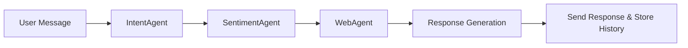

# ESB Chatbot System: Agent Modules Report

## Table of Contents
  - [Agent Workflow Overview](#agent-workflow-overview)
- [Overview](#overview)
- [IntentAgent (`intent_agent.py`)](#intentagent-intent_agentpy)
  - [Purpose](#purpose)
  - [Class: IntentAgent](#class-intentagent)
  - [Key Method: process](#key-method-process)
  - [Prompt Engineering](#prompt-engineering)
  - [Error Handling](#error-handling)
  - [Usage Example](#usage-example)
- [SentimentAgent (`sentiment_agent.py`)](#sentimentagent-sentiment_agentpy)
  - [Purpose](#purpose-1)
  - [Class: SentimentAgent](#class-sentimentagent)
  - [Key Method: process](#key-method-process-1)
  - [Integration with LangGraph](#integration-with-langgraph)
  - [Usage Example](#usage-example-1)
- [WebAgent (`web_agent.py`)](#webagent-web_agentpy)
  - [Purpose](#purpose-2)
  - [Class: WebAgent](#class-webagent)
  - [Key Method: process](#key-method-process-2)
  - [Chat History Utility](#chat-history-utility)
  - [Usage Example](#usage-example-2)

---


## Agent Workflow Overview

The ESB Chatbot backend uses a modular, multi-agent pipeline to process each user message. The typical workflow is as follows:

### 1. Input Reception
- The user sends a message to the chatbot (via web UI or API).
- A new `ChatbotState` object is created, containing the user's message and session context.

### 2. Intent Detection (IntentAgent)
- The `IntentAgent` analyzes the message to classify the user's intent (e.g., question, feedback, complaint, out_of_scope, etc.).
- The agent updates the `ChatbotState` with the detected intent, confidence, and reasoning.
- This intent is used to determine which downstream agents or actions are relevant.

### 3. Sentiment Analysis (SentimentAgent)
- The `SentimentAgent` analyzes the emotional tone of the message (positive, negative, neutral).
- The agent updates the `ChatbotState` with a `SentimentResult` (label, confidence, reasoning).
- Sentiment can be used for analytics, escalation, or personalized responses.

### 4. Web Information Retrieval (WebAgent)
- If the intent or context suggests the need for external information (e.g., program info, event details), the `WebAgent` is invoked.
- The agent queries ESB's official website and Facebook page (via LLM prompt) and updates `state.context["web_info"]` with relevant results.

### 5. Response Generation
- The updated `ChatbotState` (now containing intent, sentiment, and web info) is passed to a response generation module (not detailed here, but typically another LLM call or template engine).
- The final response is sent back to the user and stored in chat history.

### 6. State Persistence
- All relevant state (messages, intent, sentiment, web info) is stored in MongoDB for analytics, auditing, and future context.

### 7. Orchestration (LangGraph)
- In advanced deployments, the agents are composed as nodes in a LangGraph pipeline, allowing for conditional execution, branching, and more complex workflows.
- The typical LangGraph flow is:
  - `sentiment` → `intent` → `web` → `refiner` → `reflection` → END
- Each node receives the current state, processes it, and passes it to the next node.

#### Example Workflow Diagram



This modular design allows for easy extension (e.g., adding new agents, branching logic, or post-processing steps) and robust error handling at each stage.

---


## IntentAgent (`intent_agent.py`)

### Purpose
The `IntentAgent` is responsible for classifying the user's intent from a chat message. It leverages a large language model (Groq Llama 3.3 70B Versatile) to:
- Identify the user's intent from a predefined or open set of categories (e.g., greeting, complaint, feedback, program info, out_of_scope, etc.).
- Provide a confidence score and reasoning for the classification.
- Enable downstream agents (e.g., WebAgent, SentimentAgent) to adapt their behavior based on intent.

### Class: `IntentAgent`
- **Constructor:**
  - `IntentAgent(session_id: Optional[str] = None)`
    - `session_id`: (optional) Unique identifier for the chat session. If not provided, a new UUID is generated.
- **Attributes:**
  - `session_id`: Used for tracking and logging per-session analytics.

### Key Method: `process`
- **Signature:** `process(state: ChatbotState) -> ChatbotState`
- **Parameters:**
  - `state`: A `ChatbotState` object containing the user's message and conversation context.
- **Flow:**
  1. Loads ESB program data (from JSON) to provide context for the LLM.
  2. Constructs a detailed prompt, including:
     - Explicit instructions for intent classification.
     - A list of possible intents (with examples).
     - ESB program data as context.
     - The user's actual message.
  3. Calls the Groq LLM API with the prompt.
  4. Parses the LLM's JSON response, extracting:
     - `intent`: The predicted intent label (string).
     - `confidence`: Confidence score (float, 0.0-1.0).
     - `reasoning`: Brief explanation of the classification.
  5. Updates the `ChatbotState`:
     - `state.intent` is set to the predicted intent.
     - `state.context["intent_confidence"]` and `state.context["intent_reasoning"]` are set.
  6. If the LLM call or JSON parsing fails, sets intent to `out_of_scope`, confidence to `0.0`, and logs the error in `state.context["intent_error"]`.
- **Output:**
  - Returns the updated `ChatbotState` with intent and context fields populated.

### Prompt Engineering
- The prompt is carefully engineered to:
  - Prevent the LLM from defaulting to generic intents (e.g., "greeting") unless appropriate.
  - Force the LLM to respond only with a JSON object for easy parsing.
  - Provide ESB-specific context to improve classification accuracy.
  - Include multiple examples to guide the LLM's output format and intent mapping.

### Error Handling
- If the LLM call fails (e.g., network error, API error) or the response is not valid JSON:
  - `state.intent` is set to `out_of_scope`.
  - `state.context["intent_confidence"]` is set to `0.0`.
  - The error message is stored in `state.context["intent_error"]` for debugging/logging.
- This ensures the chatbot fails gracefully and does not break the conversation flow.

### Integration Notes
- The `IntentAgent` is designed to be stateless except for the session ID.
- It can be used as a node in a LangGraph pipeline or called directly in a chatbot pipeline.
- The intent output can be used to trigger downstream actions (e.g., fetching program info, escalating to admin, etc.).

### Usage Example
```python
from src.agents.intent_agent import IntentAgent
from src.core.models import ChatbotState

agent = IntentAgent()
state = ChatbotState(user_message="Can you tell me about the MBA program?")
state = agent.process(state)
print("Intent:", state.intent)  # e.g., 'ask_program_info'
print("Confidence:", state.context["intent_confidence"])
print("Reasoning:", state.context["intent_reasoning"])
```

---


## SentimentAgent (`sentiment_agent.py`)

### Purpose
The `SentimentAgent` analyzes the emotional tone of user messages, classifying them as positive, negative, or neutral. It uses the Groq Llama 3.3 70B Versatile LLM and follows the ReAct (Reason + Act + Observe) pattern for robust, explainable sentiment analysis.

### Class: `SentimentAgent`
- **Constructor:**
  - `SentimentAgent(session_id: Optional[str] = None)`
    - `session_id`: (optional) Unique identifier for the chat session. If not provided, a new UUID is generated.
- **Attributes:**
  - `session_id`: Used for tracking and logging per-session analytics.

### Key Method: `process`
- **Signature:** `process(state: ChatbotState) -> ChatbotState`
- **Parameters:**
  - `state`: A `ChatbotState` object containing the user's message and conversation context.
- **Flow:**
  1. Loads ESB program data (from JSON) to provide context for the LLM.
  2. Constructs a prompt instructing the LLM to analyze sentiment and respond with a JSON object containing:
     - `label`: Sentiment label (`positive`, `negative`, or `neutral`).
     - `confidence`: Confidence score (float, 0.0-1.0).
     - `reasoning`: Brief explanation of the classification.
  3. Calls the Groq LLM API with the prompt.
  4. Parses the LLM's JSON response and dynamically creates a `SentimentResult` object.
  5. Updates the `ChatbotState`:
     - `state.sentiment_result` is set to the new result object.
  6. If the LLM call or JSON parsing fails, sets sentiment to neutral, confidence to 0.0, and logs the error in the reasoning field.
- **Output:**
  - Returns the updated `ChatbotState` with `sentiment_result` populated.

### Integration with LangGraph
- Provides a factory function `create_sentiment_node` for use as a node in LangGraph pipelines.
- Includes a conditional function `should_analyze_sentiment` to determine if sentiment analysis is needed (e.g., only for sufficiently long user messages).
- Can be combined with other agents (e.g., IntentAgent, WebAgent) in a multi-step reasoning pipeline.

### Error Handling
- If the LLM call fails or the response is not valid JSON:
  - `state.sentiment_result` is set to a neutral label with confidence 0.0 and the error message as reasoning.
- This ensures the chatbot always returns a valid sentiment result, even on failure.

### Usage Example
```python
from src.agents.sentiment_agent import SentimentAgent
from src.core.models import ChatbotState

agent = SentimentAgent()
state = ChatbotState(user_message="I love the entrepreneurship program at ESB!")
state = agent.process(state)
print("Sentiment:", state.sentiment_result.label)  # e.g., 'positive'
print("Confidence:", state.sentiment_result.confidence)
print("Reasoning:", state.sentiment_result.reasoning)
```

---


## WebAgent (`web_agent.py`)

### Purpose
The `WebAgent` is responsible for gathering relevant web information to answer user queries, especially those requiring up-to-date or detailed ESB program info. It uses the Groq Llama 3.3 70B Versatile LLM to:
- Search ESB's official website and Facebook page for context-aware answers.
- Provide a structured list of web results for downstream response generation.

### Class: `WebAgent`
- **Constructor:**
  - `WebAgent(session_id: Optional[str] = None)`
    - `session_id`: (optional) Unique identifier for the chat session. If not provided, a new UUID is generated.
- **Attributes:**
  - `session_id`: Used for tracking and logging per-session analytics.

### Key Method: `process`
- **Signature:** `process(state: ChatbotState) -> ChatbotState`
- **Parameters:**
  - `state`: A `ChatbotState` object containing the user's message and conversation context.
- **Flow:**
  1. Loads ESB program data and official URLs from environment variables.
  2. Constructs a prompt instructing the LLM to search for relevant web info and respond with a JSON array of results.
  3. Calls the Groq LLM API with the prompt.
  4. Parses the LLM's JSON response and updates `state.context["web_info"]` with the results (list of dicts).
  5. If the response is not a list, sets `web_info` to an empty list.
  6. On error, sets `web_info` to an empty list and logs the error in `state.context["web_info_error"]`.
- **Output:**
  - Returns the updated `ChatbotState` with `web_info` in the context.

### Chat History Utility
- The module includes a utility function `save_chat_history(user_id, username, message, sender)` to store chat messages in MongoDB for persistence and analytics.
  - Parameters:
    - `user_id`: The user's unique identifier.
    - `username`: The user's name.
    - `message`: The message content.
    - `sender`: The sender type (default: "student").
- This enables analytics, auditing, and personalized experiences.

### Error Handling
- If the LLM call fails or the response is not valid JSON:
  - `state.context["web_info"]` is set to an empty list.
  - The error message is stored in `state.context["web_info_error"]` for debugging/logging.
- This ensures the chatbot can gracefully degrade and still provide a response.

### Integration Notes
- The `WebAgent` is designed to be stateless except for the session ID.
- It can be used as a node in a LangGraph pipeline or called directly in a chatbot pipeline.
- The web info output can be used to enrich LLM responses or trigger follow-up actions.

### Usage Example
```python
from src.agents.web_agent import WebAgent
from src.core.models import ChatbotState

agent = WebAgent()
state = ChatbotState(user_message="What are the admission requirements for ESB?")
state = agent.process(state)
print("Web Info:", state.context["web_info"])
```

---

_Last updated: July 11, 2025_
