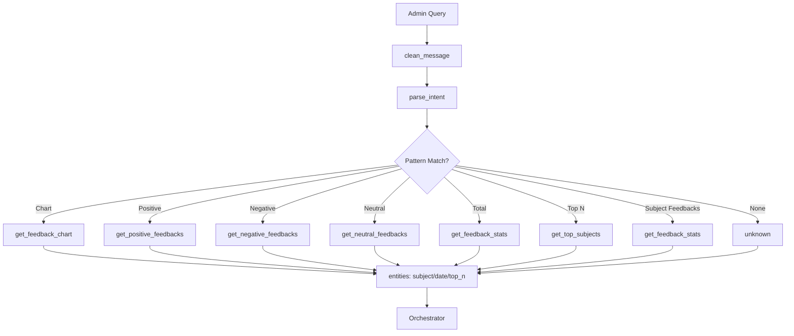

# intent_parser.py — Module Documentation

## Overview

The `intent_parser.py` module is the core Natural Language Understanding (NLU) component for the ESB admin chatbot. It parses free-form admin queries, extracts key entities (subject, date), and determines the user's intent (e.g., request for feedback statistics, charts, or top subjects). This enables the chatbot to transform natural language into structured actions for downstream analytics and visualization.

---

## Main Functions

### 1. `clean_message(msg)`
- **Purpose:** Normalize and clean the input message for robust parsing.
- **How:**
  - Strips whitespace, converts to lowercase.
  - Replaces typographic apostrophes.
  - Removes quotes and punctuation.
  - Leaves only alphanumeric and whitespace.
- **Usage:** Preprocessing step for all parsing.

### 2. `extract_subject(msg)`
- **Purpose:** Extracts the subject (course/matière) from the message.
- **Logic:**
  - Uses regex to match patterns like “pour la matière finance”, “matière ia”, etc.
  - Removes trailing period/graph keywords (e.g., “aujourd’hui”, “chart”).
  - If regex fails, checks for any valid subject from a predefined list.
- **Robustness:** Handles French/English, accents, and common variations.

### 3. `extract_date_from_msg(msg)`
- **Purpose:** Extracts a date or period from the message.
- **Logic:**
  - Recognizes explicit dates (DD/MM/YYYY, YYYY-MM-DD).
  - Detects days of the week (French/English).
  - Handles keywords: “hier”, “aujourd’hui”, “semaine”, “mois”, etc.
- **Returns:** Standardized date string (`YYYY-MM-DD`) or period key (`today`, `this_week`, etc.).

### 4. `parse_intent(message)`
- **Purpose:** Main entry point. Determines the intent and extracts entities.
- **Logic:**
  - Cleans the message.
  - Checks for patterns in priority order:
    - Chart requests (bar, pie, etc.)
    - Positive/negative/neutral feedback requests
    - Total feedbacks
    - Top N subjects
    - Raw feedbacks for a subject
  - For each, extracts relevant entities (subject, date, top_n).
  - Returns a tuple: `(intent, entities)`.

---

## Supported Intents

- `get_feedback_chart`: Request for feedback charts (bar, pie, etc.).
- `get_positive_feedbacks`, `get_negative_feedbacks`, `get_neutral_feedbacks`: Filtered feedback by sentiment.
- `get_feedback_stats`: Total feedbacks, optionally by subject/date.
- `get_top_subjects`: Top N subjects with most feedbacks.
- `unknown`: Fallback if no intent is matched.

---

## Entity Extraction

- **Subject:** Extracted via regex and validated against a list of official subjects.
- **Date:** Extracted via regex, keywords, or day-of-week logic.
- **Top N:** Extracted from the message if present, defaults to 1.

---

## Error Handling & Robustness

- Handles both French and English queries.
- Tolerant to typos, accents, and various phrasings.
- Returns `unknown` intent if nothing matches, allowing for graceful fallback.

---

## Example Usage

```python
intent, entities = parse_intent("Montre-moi le graphique des feedbacks pour la matière finance cette semaine")
# intent: "get_feedback_chart"
# entities: {"subject": "finance", "date": "this_week"}
```

---

## Integration Points

- **Upstream:** Receives raw admin queries from the web interface.
- **Downstream:** Feeds structured intent and entities to the orchestrator for action.

---

## Design Notes

- Prioritizes chart requests to avoid ambiguity.
- Modular pattern lists for easy extension (add new intents by adding patterns).
- Centralizes subject/date extraction for consistency.

---

## Limitations

- Relies on a static list of valid subjects.
- May not handle highly ambiguous or novel phrasings.
- Fallback is generic (“unknown”) if no pattern matches.

---

## Summary Table

| Function                | Purpose                        | Returns                |
|-------------------------|--------------------------------|------------------------|
| `clean_message`         | Normalize/clean input          | Cleaned string         |
| `extract_subject`       | Extract subject (matière)      | Subject string/None    |
| `extract_date_from_msg` | Extract date/period            | Date string/period key |
| `parse_intent`          | Main NLU, intent/entity parse  | (intent, entities)     |

---

## Workflow Diagram



---

## Conclusion

The `intent_parser.py` module is a robust, extensible NLU component that enables the ESB admin chatbot to understand and act on a wide range of admin queries, supporting both French and English, and handling complex entity extraction for downstream analytics and visualization.
