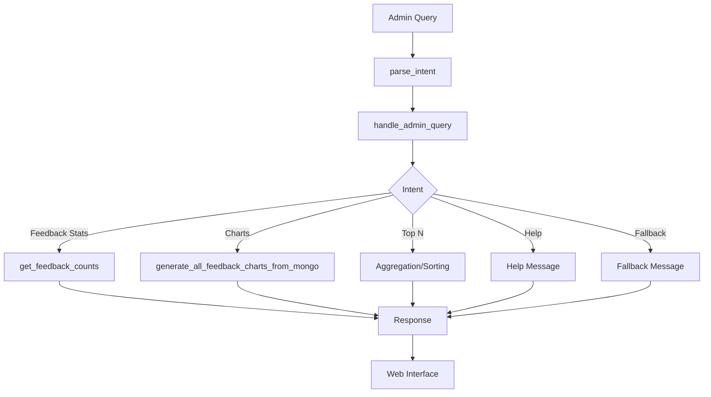

# orchestrator.py — Module Documentation

## Overview

The `orchestrator.py` module is the central controller for the ESB admin chatbot's backend logic. It interprets parsed intents and entities from admin queries, coordinates data retrieval and analytics, manages session state, and generates responses (including statistics, charts, and help messages). It integrates with the intent parser, subject validator, and visualization modules to deliver a robust, conversational analytics experience for administrators.

---

## Main Functions

### 1. `strip_accents(text)`
- **Purpose:** Removes accents from a string for robust, accent-insensitive matching.
- **Usage:** Used for help pattern matching and subject normalization.

### 2. `get_feedback_counts(mongo_db, collection_feedbacks, subject, date)`
- **Purpose:** Aggregates feedback counts by sentiment (positive, negative, neutral) for a given subject and date/period.
- **How:**
  - Filters feedbacks from MongoDB by timestamp and subject.
  - Tallies sentiment counts and returns totals.

### 3. `handle_admin_query(message, mongo_db, collection_feedbacks, collection_admin, session)`
- **Purpose:** Main entry point for handling admin queries.
- **Logic:**
  - Parses intent and entities from the message.
  - Handles a wide range of intents:
    - Feedback statistics (total, by subject, by sentiment)
    - Chart generation (bar, pie, stacked, comparative)
    - Top N subjects
    - Help and fallback responses
    - Session state management (pending intents, last subjects)
  - Integrates with visualization and subject validation modules.
  - Returns a tuple: (response, metadata)

---

## Supported Intents & Behaviors

- **Feedback by Sentiment:** Lists or counts positive, negative, or neutral feedbacks for a period/subject.
- **Top Subjects:** Returns the top N subjects with the most feedbacks for a period.
- **Charts:** Generates and returns URLs for feedback analytics charts (bar, pie, stacked, comparative).
- **Help:** Provides a list of supported commands and usage examples.
- **Fallback:** Handles unrecognized queries with suggestions.
- **Session Management:** Remembers last subjects, pending intents, and user context.

---

## Example Usage

```python
response, meta = handle_admin_query(
    "Donne-moi le feedback chart pour la matière finance cette semaine",
    mongo_db, "history_student", "admin", session
)
# response: HTML/text with chart URLs and stats
# meta: {"chart_urls": {...}}
```

---

## Integration Points

- **Upstream:** Receives parsed intents/entities from the intent parser.
- **Downstream:** Calls visualization and subject validation modules, returns responses to the web interface.

---

## Design Notes

- Modular, extensible intent handling (easy to add new admin features).
- Robust error handling and user guidance (help, fallback, validation).
- Session-aware: supports multi-turn admin conversations.
- Handles both French and English, with accent/case insensitivity.

---

## Limitations

- Assumes feedback messages contain subject names for matching.
- Some responses are HTML-formatted for web display.
- Static help patterns; new features require manual pattern updates.

---

## Summary Table

| Function                | Purpose                                 | Returns                |
|-------------------------|-----------------------------------------|------------------------|
| `strip_accents`         | Remove accents from string              | String                 |
| `get_feedback_counts`   | Aggregate feedbacks by sentiment/date   | (dict, int)            |
| `handle_admin_query`    | Main orchestrator for admin queries     | (response, metadata)   |

---

## Workflow Diagram



---

## Conclusion

The `orchestrator.py` module is the backbone of the ESB admin chatbot's analytics and reporting logic, providing a flexible, session-aware, and user-friendly interface for administrators to access actionable feedback insights.
